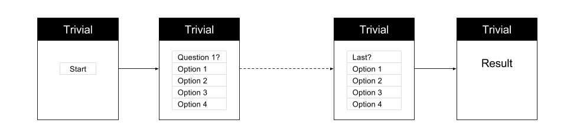

# Trivial

Today you will be creating a Trivial Game with React and Redux

The questions should come from `https://opentdb.com/`. Check [here](https://opentdb.com/api.php?amount=3) as an example.

Tools for today:
- React
- Material UI
- Redux
- React-Router



There will be 3 different routes.
- `/` with just a button to start the Trivial.
- `/question/:order` to render a specific question.
- `/result` to show the result after the last question.

If you are brave enough. Go ahead and try to implement without any guidance, `\o/ \o/ \o/ \o/`.

Things to have in mind:

- Keep the folder structure explained on the previous days:
```
src/components/App/index.js
```
- `PropTypes`
- Presentational vs Container Components

Follow the next **User Story** and read the **Tips** before starting.

### User Story

1. User enters in the Home Page. There is a `Start` button there. -Questions are fetched and stored in Redux Store-.
2. User clicks the `Start` Button.
3. User goes to the first question `questions/1`. The first question is rendered.
4. User selects an answer for the question.
5. User is redirected to the next question `questions/2`.
6. Same steps from 3 to 5 until the last question.
6. After answering the last question, the user is redirected to `/result`. Where the result is shown.

### Tips

- Use `react-router-dom` for Routing.
- Go step by step. You don't necessarily need to finish all the functionality in one day.
- `Link` can have other Components as children.
- Fetch the questions when user goes to the home page: `/`.
- Inspect the API Response first.
- The Question Resource coming from the API might need some changes before sending it to the Component. Use `mapStateToProps` to prepare the Redux `state` for the Component.
- Add some order to your questions.
- The `question` of the Response might have some escaped characters. Here is the tip to render them properly:

  ```javascript
  <p dangerouslySetInnerHTML={ { __html: this.state.question.question } } />
  ```

### Bonus Features

- Implement `redux-thunk` for fetching the Questions.
- Refactor and differentiate between Presentational and Container Components.
- Select Questions Category at the beginning.
- Display differently true/false and multiple choice questions.
- Select the amount of questions at the beginning.
- Add more than one player.
