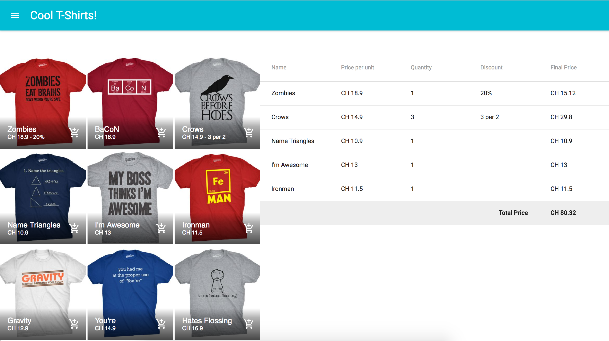

# JS-Browser - Day 5

Today it is a mix between assignment and regular day.

There are no new concepts. However, the assignment is a project with React.

Since you have only seen React for just one day, you are welcome to ask for assistance from the instructors during today.

### Material UI

Material UI is a library that implements Google's Material Design as React Components.

You are encouraged to use it for today's assignment.

Go check the [notes](material_ui.md).

### Functional Components

So far every time that you needed a components you were creating a class with the `render` method.

Sometimes your components was only the class and the `render` method. There is another way to create Components.

[Functional Components](funcitonal_components.md) are just functions that expect the `props` as parameter and return JSX.

Same with Material UI. You are encouraged to use Functional Components in today's project.

Not just today, from now on.

### Shopping Cart

User Story:
1. The user is presented with a list of items.
2. User can click on one item to add it to his/her shopping cart.
3. The Shopping Cart list is updated with the new product.
4. Price for the individual item is calculated.
5. Price of the total cart is calculated

### Bonus Features

- Products can have two types of discount:
  - 20% off. Or some % off
  - 3 xz 2 offers. Or 2 x 1 offers, ...
- Remove a product from the cart
- Edit the quantity of a product in the cart
- Add Taxes
- Add Different currencies
