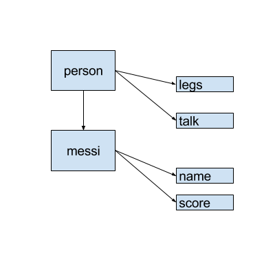

# Advanced Objects

Before you move one, please review the basics of objects during week 1:

- [Objects](../../js-fundamentals/day3/objects.md)
- [this](../../js-fundamentals/day3/this.md)

The following concepts are a few of the most controversial topics in the Javascript world. As well as the most misunderstood topics by beginners.

If you want to master Javascript, this are topics you need to be very familiar and comfortable with.

### There are no Classes in JS

The fist and most important lesson for OOP in Javascript is to understand that there are no Classes in Javascript. Instances are just objects, plain objects.

In class-based OOP, you first define a Class, the 'blueprint' that will serve to create new instances. It's like a parent having children that look like the parent.

However, in Javascript there is no 'blueprint'. You just have an object and create other like that one.

Let's review this concept with an analogy.

In class-based OOP, you have the 'blueprint' of a car, and then build more cars based on the blueprint.

With Javascript, you have a car and then create another object similar to the car that you have. Any car will serve for the purpose of creating other cars. No 'blueprint'.

### What does `new` do?

The keyword `new` is just a way to simulate classical inheritance from other programming languages. However, you could create your own `new` keyword.

This is what the `new` keyword is doing under the hood.

1. It creates a plain objects.
2. Calls the constructor with the keyword `this` bound to the recently created object.
3. Sets the prototype -more about the prototype later- of the recently created object to the constructor prototype.
4. Returns the object.

Here is a simple approach:

```Javascript
function myNew(fn) {
  var newObj = {}; // 1.
  fn.call(newObj); // 2.
  Object.setPrototypeOf(newObj, fn.prototype); // 3.

  return newObj; // 4.
}
```

Go ahead and try it out.

```javascript
function Cat() {
  this.name = 'Markov';
}
var markov = myNew(Cat);
```

Douclas Crockford explained why the keyword `new` exists like this:

```
JavaScript’s constructor pattern did not appeal to the classical crowd.
It also obscured JavaScript’s true prototypal nature.
As a result, there are very few programmers who know how to use the language effectively.
```

### Prototype inheritance and `Object.create`

In ES5, Javascript introduced `Object.create`. This is a method to create a new object with the prototype set to the object passed in the `create` method.

```javascript
var person = {
  legs: 2,
  talk: function() {
    console.log('Talking...');
  }
};

var messi = Object.create(person);
messi.name = 'Messi';
messi.score = function() {
  console.log('Goal!!');
}

messi.talk();
messi.legs // 2
console.log(messi.__proto__ === person); // true
```

Although that it's called Prototype, the `prototype` property only exists on functions, in case they are used as constructors.

In order to get the `prototype` of an object you use the `__proto__` property.

### Prototype inheritance



When `messi.talk` is called. First it will try to find the property in the object `messi`. If it doesn't find it, then it will go to the prototype, which in this case is `person`. Since `person` already has that property, it will get the value and stop searching.

### Classical Inheritance vs Prototypal Inheritance

Let's review the differences with some points:

- A class is a blueprint, a prototype is an object instance.
- A class can't be used as any other instance.
- In class inheritance, instances inherit from the blueprint. In prototypal inheritance, there is the delegation through the prototype.
- If you already have an instance, and make a change in the class, the instances won't be affected. However, if you change an object, all the instances using that object as a prototype will be affected.

There is a great analogy in [this great article](https://john-dugan.com/object-oriented-javascript-pattern-comparison/) on Object Creating patterns:

```
When your parents had you, you inherited their DNA — you received a copy of it.
When they broke their leg, yours did not break. JavaScript is the opposite of this.
In JavaScript, when your parents break their leg, yours breaks too.
A term better suited than prototypal inheritance to JavaScript is prototypal delegation.
When a new object is created from another object in JavaScript, it links back to the parent object’s prototype
properties and methods as opposed to copying them.
```

### How to create Objects

After learning that there are no Classes and instances. That everything are objects, why do we use `new` and constructors?

Using `new` and constructors are the most common way of creating instances. It is called **Constructor Pattern**.

```JavaScript
var Person = function(name) {
  this.legs = 2;
  this.name = name;
}

Person.protype.talk = function() {
  console.log('Talking...');
}

var messi = new Person('Messi');
messi.score = function() {
  console.log('Goal!');
}
```

However, there are many ways to create objects:

**Object Literal**

Create a plain object every time you need one.

```JavaScript
var messi = {
  legs: 2,
  talk: function() {
    console.log('Talking');
  },
  score: function() {
    console.log('Goal!');
  },
  name: 'Messi'
};
```

**Object.create**

You can also use `Object.create` as we have seen earlier:

```javascript
var person = {
  legs: 2,
  talk: function() {
    console.log('Talking...');
  }
};

var messi = Object.create(person);
messi.name = 'Messi';
messi.score = function() {
  console.log('Goal!!');
}
```

**Factory Pattern**

Use a function to create the object. Mainly used for DRY purposes.

```javascript
var createPerson = function(name) {
  var obj = {};
  obj.name = name;
  obj.legs = 2;
  obj.talk = function() {
    console.log('Talking');
  };

  return obj;
}

var messi = createPerson('Messi');
messi.score = function() {
  console.log('Goal!');
}
```

**OLOO**

OLOO stands for Objects Linked to Other Objects.

```javascript
var Person = {
  init: function(name) {
    this.name = name;
    this.legs = 2;
  },
  talk: function() {
    console.log('Talking');
  }
};

var messi = Object.create(Person);
messi.init('Messi');

messi.score = function() {
  console.log('Goal!');
}
```

### Conclusions

Let's review the main conclusions' for this lesson:

- There are no Classes in Javascript.
- Everything in JS are literal objects.
- Objects uses prototypal inheritance.
- In prototypal inheritance, objects are linked to other objects through their prototype.
- There are many ways to create objects in Javascript.

Resources for further reading:

- [Youtube Playlist on Objects in JS](https://www.youtube.com/watch?v=GhbhD1HR5vk&index=1&list=PL0zVEGEvSaeHBZFy6Q8731rcwk0Gtuxub)
- [Prototypal Object-Oriented Programming using JavaScript](http://alistapart.com/article/prototypal-object-oriented-programming-using-javascript)
- [Common Misconceptions About Inheritance in Javascript](https://medium.com/javascript-scene/common-misconceptions-about-inheritance-in-javascript-d5d9bab29b0a#.p1xe17b6c)
- [Object Oriented Javascript Pattern Comparison](https://john-dugan.com/object-oriented-javascript-pattern-comparison/)
- [Composition vs Inheritance](https://www.youtube.com/watch?v=dYUZiJEy0JE)
- [Classical Inheritance is Obsolete](https://vimeo.com/69255635)
