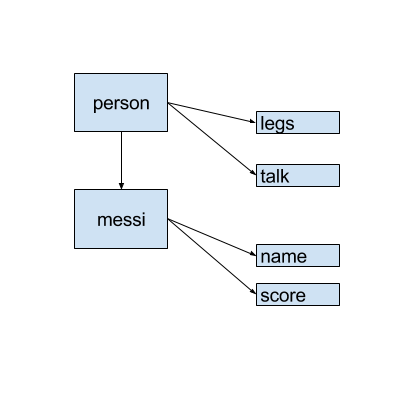

include::../../../_settings_deck.adoc[]
// include::../../../_settings_reveal.adoc[]

// beige, blond, default, moon, night, serif, simple, sky, solarized
// :revealjs_customtheme: reveal.js/css/theme/serif.css

= Advanced Objects

== Advanced Objects

* No classes in JS
* Prototype inheritance
* How to create objects
* Inheritance

== No classes in JS

.MyNew
[source,javascript,indent=0]
----
function myNew(fn) {
  var newObj = {}; // 1.
  fn.call(newObj); // 2.
  Object.setPrototypeOf(newObj, fn.prototype); // 3.

  return newObj; // 4.
}
----

== Prototypal inheritance

`prototype` and `__proto__`

== How to create objects

- Constructor Pattern
- Object literal
- `Object.create`
- Factory Pattern
- Objects Linked to Other Objects or OLOO

== Inheritance

.MyNew
[source,javascript,indent=0]
----
var Singer = function(name) {
  Person.call(this, name); // use parent constructor
  this.artisticName = 'Fancy ' + name; // child properties
}

Singer.prototype = Object.create(Person.prototype); // link to parent prototype

Singer.prototype.sing = function() { // add custom methods
  console.log('Singing!');
}
----
