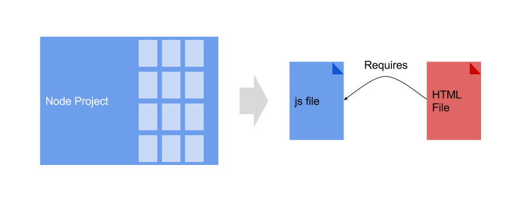

include::../../../_settings_deck.adoc[]
// include::../../../_settings_reveal.adoc[]

// beige, blond, default, moon, night, serif, simple, sky, solarized
// :revealjs_customtheme: reveal.js/css/theme/serif.css

= Webpack

== Webpack

* Current Front End Development
* Webpack

== Front End Development

`node` is used during development to create the javascript file that will be sent to the browser.

== Webpack

Webpack is a module bundler.

.From Webpack Docs
----
Webpack takes modules with dependencies and generates static assets representing those modules.
----

== Webpack

- *npm* dependencies
- Latest Javascript features: ES6
- Production Performance
